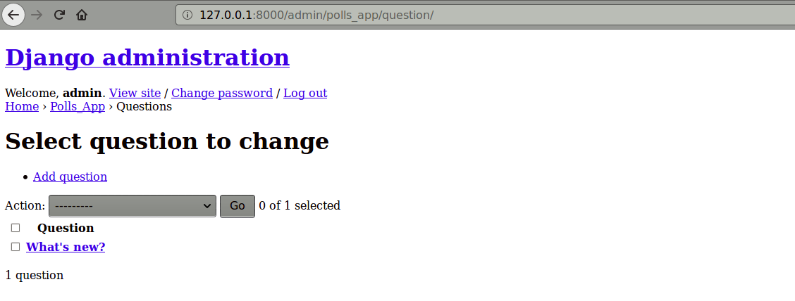
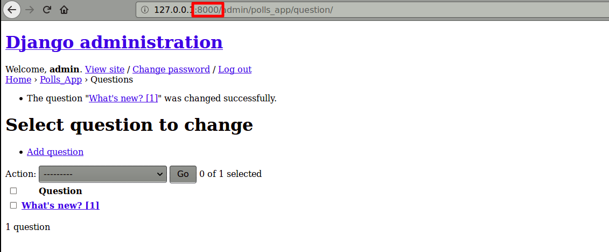
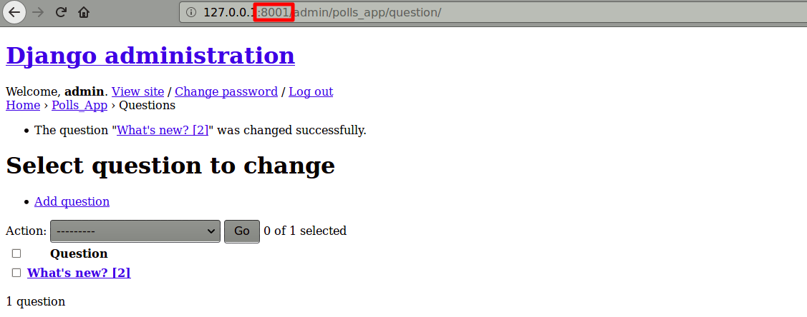
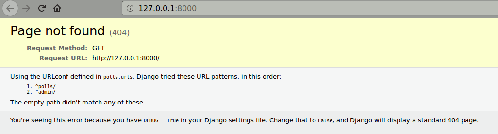
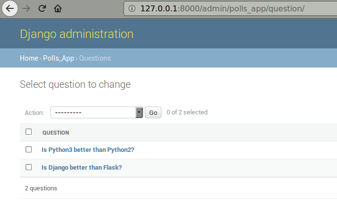

# Cloud Django

This project follows on from my [Writing_Django](https://github.com/mramshaw/Writing_Django) project, which is a simple Hello World in Django.

It will use [gunicorn](http://gunicorn.org/) which is a web server for [Django](https://docs.djangoproject.com/en/1.11/howto/deployment/wsgi/gunicorn/).
Specifically, it is a [WSGI](https://en.wikipedia.org/wiki/Web_Server_Gateway_Interface) server.

It will also use [Docker](https://github.com/mramshaw/Docker) and [Kubernetes](https://github.com/mramshaw/Kubernetes)
 (initially via [minikube](https://github.com/kubernetes/minikube)).

It will be migrated to [PostgreSQL](https://www.postgresql.org/) for persistence via the Python Postgres module `psycopg2`.

The plan of attack is as follows:

* [Install and test 'gunicorn'](https://github.com/mramshaw/Cloud_Django#gunicorn)
* [Dockerize our app](https://github.com/mramshaw/Cloud_Django#docker)
* [Run our app (minikube: local Kubernetes)](https://github.com/mramshaw/Cloud_Django#minikube)
* [Migrate our app to PostgreSQL](https://github.com/mramshaw/Cloud_Django#migration-to-postgres)

Once all of this has been carried out locally, our app will be ready to be deployed in the cloud (AWS, Azure, GCP, etc.).

One of the convenient things about __minikube__ is that it is local; this saves a lot of upload/download time. It's ___fast___.

## gunicorn

To install locally:

    $ pip install --user gunicorn

As usual, replace `pip` with `pip3` for Python3.

To verify the version:

    $ pip list --format=legacy | grep gunicorn

Or simply use the `requirements.txt` file:

    $ pip install --user -r requirements.txt

Lets see if it runs (this needs to be in the same folder as `manage.py`):

    $ gunicorn polls.wsgi
    [2018-02-13 17:30:31 +0000] [6232] [INFO] Starting gunicorn 19.7.1
    [2018-02-13 17:30:31 +0000] [6232] [INFO] Listening at: http://127.0.0.1:8000 (6232)
    [2018-02-13 17:30:31 +0000] [6232] [INFO] Using worker: sync
    [2018-02-13 17:30:31 +0000] [6236] [INFO] Booting worker with pid: 6236
    Not Found: /
    Not Found: /favicon.ico
    Not Found: /favicon.ico
    ^C[2018-02-13 17:31:06 +0000] [6232] [INFO] Handling signal: int
    [2018-02-14 01:31:06 +0000] [6236] [INFO] Worker exiting (pid: 6236)
    [2018-02-13 17:31:06 +0000] [6232] [INFO] Shutting down: Master
    $

Now we need to open up `gunicorn` with a `gunicorn.conf` file. By default, `gunicorn`
runs locally and will only accept local connections. We will configure it to run in
__promiscuous mode__ (which is a terrible practice, we should really run it behind a
front-end, but we can fix this later).

Once more, with a config file:

    $ gunicorn -c ../gunicorn.conf polls.wsgi
    [2018-02-18 15:24:35 +0000] [16256] [INFO] Starting gunicorn 19.7.1
    [2018-02-18 15:24:35 +0000] [16256] [INFO] Listening at: http://0.0.0.0:8000 (16256)
    [2018-02-18 15:24:35 +0000] [16256] [INFO] Using worker: sync
    [2018-02-18 15:24:35 +0000] [16260] [INFO] Booting worker with pid: 16260
    ...
    ^C[2018-02-18 15:24:37 +0000] [16256] [INFO] Handling signal: int
    [2018-02-18 23:24:37 +0000] [16299] [INFO] Worker exiting (pid: 16299)
    ...
    [2018-02-18 23:24:37 +0000] [16285] [INFO] Worker exiting (pid: 16285)
    [2018-02-18 15:24:37 +0000] [16256] [INFO] Shutting down: Master
    $

Okay, everything runs.

## Docker

Lets see if we can save some Docker build time:

    $ sudo docker search python
    ....
    $ sudo docker search django
    ....
    $ sudo docker search gunicorn
    ....

Hmm, maybe it would be faster to do a search from:

    https://hub.docker.com/explore/

Or maybe not, it looks like the official Django image is __deprecated__:

    https://hub.docker.com/_/django/

[This page has a link to the Docker Store version of Django: 404]

Okay, the recommendation is to start with a Python image, lets do that.

The options are endless:

    https://hub.docker.com/_/python/

[Of course, it doesn't really make any sense to Dockerize an app with a bundled database - but we will address that later.]

#### Django settings

We need to change our Django settings to allow '192.168.99.100' (minikube traffic).
Change the line `ALLOWED_HOSTS = []` in `polls/settings.py` as follows:

    ALLOWED_HOSTS = ['192.168.99.100']

[We should revisit these settings once everything runs behind a front-end.]

#### Docker build

Lets build our dockerized app:

    $ sudo docker build -f Dockerfile_1.0 -t mramshaw4docs/python-django-gunicorn:1.0 .

Available from DockerHub [here](https://hub.docker.com/r/mramshaw4docs/python-django-gunicorn/).

#### Docker versions

Okay, lets check the software versions bundled in our Dockerized app:

    $ docker run --rm -it mramshaw4docs/python-django-gunicorn /bin/sh
    /usr/src/app # python --version
    Python 3.6.4
    /usr/src/app # python -m django --version
    1.11.10
    /usr/src/app # gunicorn --version
    gunicorn (version 19.7.1)
    /usr/src/app # exit
    $

Apart from the Python version, the same software as in the original [Writing_Django](https://github.com/mramshaw/Writing_Django) project.

## minikube

Start minikube:

    $ minikube start
    Starting local Kubernetes v1.9.0 cluster...
    Starting VM...
    Getting VM IP address...
    Moving files into cluster...
    Setting up certs...
    Connecting to cluster...
    Setting up kubeconfig...
    Starting cluster components...
    Kubectl is now configured to use the cluster.
    Loading cached images from config file.
    $

Run our dockerized app:

    $ kubectl create -f ./polls.yaml

The 'service' component of `polls.yaml` is currently a stub so we will port-forward our pod (as usual, Ctrl-C to terminate):

    $ kubectl port-forward polls-7bd58769c7-r27rr 8000:8000
    Forwarding from 127.0.0.1:8000 -> 8000
    Handling connection for 8000
    ....

This will make our app available at `127.0.0.1:8000` where we will test it:

Okay, so now we know the deployment portion of our `yaml` is good. We can kill our port-forwarding now (Ctrl-C to terminate):

    Handling connection for 8000
    ^C$

Lets increase the number of replicas to 2. Edit `polls.yaml`, save it, and apply it:

    $ kubectl apply -f ./polls.yaml
    Warning: kubectl apply should be used on resource created by either kubectl create --save-config or kubectl apply
    deployment "polls" configured
    service "polls" unchanged
    $

The warning is because this resource were created with `kubectl create`. If we change the replicas back to 1 and run `kubectl apply` again:

    $ kubectl apply -f ./polls.yaml
    deployment "polls" configured
    service "polls" unchanged
    $

So lets increase the number of replicas to 2 again:

    $ kubectl apply -f ./polls.yaml
    deployment "polls" configured
    service "polls" unchanged
    $

[Note no warning this time; the last `kubectl` was an `apply`.]

Now we will port-forward each of our Kubernetes pods and change each poll question so each pod has a different question:

    $ kubectl port-forward polls-7cd964c89-4px25 8000:8000 &
    [1] 5899
    $ Forwarding from 127.0.0.1:8000 -> 8000
    kubectl port-forward polls-7cd964c89-wqkxc 8001:8000 &
    [2] 5912
    $

__Pod 1__

__Pod 2__

Now we can try to access our Kubernetes pods through a Kubernetes service
(this will pop open a browser):

    $ minikube service polls

Everything works, so now we need to make it address a non-bundled back-end.

[Although it *works*, it looks pretty horrible as our `static` content is missing.
 We can fix that later, possibly with an `ingress` controller and/or nginx.]

Lets teardown our local Kubernetes infrastructure first:

    $ kubectl delete svc/polls deploy/polls

Finally:

    $ minikube stop
    Stopping local Kubernetes cluster...
    Machine stopped.
    $

## Migration to postgres

We will repeat most of the steps listed here:

    https://docs.djangoproject.com/en/1.11/intro/tutorial02/

However, we will be using __postgres__ instead of __sqlite__.

#### psycopg2

We will need the Python Postgres module `psycopg2`:

    $ pip install --user psycopg2

[As usual, replace with `pip3` for Python3.]

Verify the latest version:

    $ pip list --format=legacy | grep psycopg2
    psycopg2 (2.7.4)
    $

[2.7.4]

#### Docker

We will use the official Docker image for `postgres`:

    https://hub.docker.com/_/postgres/

Run it:

    $ docker run --rm -it --name polls-postgres -d postgres:10.2-alpine

And a quick smoke test:

    $ docker run -it --rm --link polls-postgres:postgres postgres:10.2-alpine psql -h postgres -U postgres
    psql (10.2)
    Type "help" for help.
    
    postgres=# help
    You are using psql, the command-line interface to PostgreSQL.
    Type:  \copyright for distribution terms
           \h for help with SQL commands
           \? for help with psql commands
           \g or terminate with semicolon to execute query
           \q to quit
    postgres=# SELECT 1;
     ?column? 
    ----------
            1
    (1 row)
    
    postgres=#

And now the __important part__ - creating our database:

    postgres=# CREATE DATABASE polls;
    CREATE DATABASE
    postgres=# \q
    $

Okay, we have a functional `postgres`. Lets tear it down:

    $ docker kill polls-postgres

[We will go through this again in `minikube` shortly.]

#### Configuration

Change `polls/settings.py` as follows. First insert:

    DATABASES = {
        'default': {
            'ENGINE': 'django.db.backends.postgresql_psycopg2',
            'NAME': 'polls',
            'USER': 'postgres',
            'PASSWORD': 'postgres',
            'HOST': os.getenv('POLLS_BACKEND_SERVICE_HOST', '127.0.0.1'),
            'PORT': os.getenv('POLLS_BACKEND_SERVICE_PORT', 5432)
        }
    }

Then remove or comment:

    DATABASES = {
        'default': {
            'ENGINE': 'django.db.backends.sqlite3',
            'NAME': os.path.join(BASE_DIR, 'db.sqlite3'),
        }
    }

[This uses __default passwords__ which is generally a very lazy and insecure practice.
It's actually even worse as we are using the __root__ postgres user and password.
The __default__ root user and password. We will need to harden all of this before
we get too much further, but especially before any move into production.]

#### minikube

Start minikube:

    $ minikube start
    ....

Start `postgres`:

    $ kubectl create -f ./postgres.yaml

And create our `polls` database:

    $ kubectl exec -it polls-backend-67c86654df-xll2q sh
    / # psql -U postgres
    psql (10.2)
    Type "help" for help.
    
    postgres=# CREATE DATABASE polls;
    CREATE DATABASE
    postgres=# \q
    / # exit
    $

Port-forward our postgres pod (as usual, Ctrl-C to terminate):

    $ kubectl port-forward polls-backend-67c86654df-xll2q 5432:5432

In a new window, run our Django server (needs to be in the folder where `manage.py` resides):

    $ cd polls
    $ ls -al
    total 64
    drwxrwxr-x 4 owner owner  4096 Feb 15 22:46 .
    drwxrwxr-x 5 owner owner  4096 Feb 16 08:27 ..
    -rw-r--r-- 1 owner owner 41984 Feb 12 10:24 db.sqlite3
    -rwxrwxr-x 1 owner owner   803 Feb 11 13:40 manage.py
    drwxrwxr-x 2 owner owner  4096 Feb 15 19:31 polls
    drwxrwxr-x 3 owner owner  4096 Feb 15 11:58 polls_app
    $ python manage.py runserver
    Performing system checks...
    
    System check identified no issues (0 silenced).
    
    You have 14 unapplied migration(s). Your project may not work properly until you apply the migrations for app(s): admin, auth, contenttypes, polls_app, sessions.
    Run 'python manage.py migrate' to apply them.
    
    February 15, 2018 - 22:09:42
    Django version 1.11.10, using settings 'polls.settings'
    Starting development server at http://127.0.0.1:8000/
    Quit the server with CONTROL-C.
    Not Found: /
    [15/Feb/2018 22:12:35] "GET / HTTP/1.1" 404 2017
    ^C$

Before killing it, check that it runs:

Lets check our [database migrations](https://docs.djangoproject.com/en/1.11/topics/migrations/):

    $ python manage.py showmigrations
    admin
     [ ] 0001_initial
     [ ] 0002_logentry_remove_auto_add
    auth
     [ ] 0001_initial
     [ ] 0002_alter_permission_name_max_length
     [ ] 0003_alter_user_email_max_length
     [ ] 0004_alter_user_username_opts
     [ ] 0005_alter_user_last_login_null
     [ ] 0006_require_contenttypes_0002
     [ ] 0007_alter_validators_add_error_messages
     [ ] 0008_alter_user_username_max_length
    contenttypes
     [ ] 0001_initial
     [ ] 0002_remove_content_type_name
    polls_app
     [ ] 0001_initial
    sessions
     [ ] 0001_initial
    $

And run them:

    $ python manage.py migrate
    Operations to perform:
      Apply all migrations: admin, auth, contenttypes, polls_app, sessions
    Running migrations:
      Applying contenttypes.0001_initial... OK
      Applying auth.0001_initial... OK
      Applying admin.0001_initial... OK
      Applying admin.0002_logentry_remove_auto_add... OK
      Applying contenttypes.0002_remove_content_type_name... OK
      Applying auth.0002_alter_permission_name_max_length... OK
      Applying auth.0003_alter_user_email_max_length... OK
      Applying auth.0004_alter_user_username_opts... OK
      Applying auth.0005_alter_user_last_login_null... OK
      Applying auth.0006_require_contenttypes_0002... OK
      Applying auth.0007_alter_validators_add_error_messages... OK
      Applying auth.0008_alter_user_username_max_length... OK
      Applying polls_app.0001_initial... OK
      Applying sessions.0001_initial... OK
    $

So now we can create our app migration(s):

    $ python manage.py makemigrations polls_app
    No changes detected in app 'polls_app'
    $

Interestingly, this is __not__ what I was expecting. Lets double-check:

    $ mv polls_app/migrations/0001_initial.py polls_app/migrations/0001_initial.py.orig
    $ python manage.py makemigrations polls_app
    Migrations for 'polls_app':
      polls_app/migrations/0001_initial.py
        - Create model Choice
        - Create model Question
        - Add field question to choice
    $ diff -uw polls_app/migrations/0001_initial.py.orig polls_app/migrations/0001_initial.py
    --- polls_app/migrations/0001_initial.py.orig	2018-02-11 15:32:37.401180000 -0800
    +++ polls_app/migrations/0001_initial.py	2018-02-15 14:28:24.501089257 -0800
    @@ -1,5 +1,5 @@
     # -*- coding: utf-8 -*-
    -# Generated by Django 1.11.10 on 2018-02-11 23:32
    +# Generated by Django 1.11.10 on 2018-02-15 22:28
     from __future__ import unicode_literals
     
     from django.db import migrations, models
    $

Okay, looks like everything is copacetic:

    $ rm polls_app/migrations/0001_initial.py.orig

Lets see if the generated SQL is any different from the __sqlite__ SQL:

    $ python manage.py sqlmigrate polls_app 0001
    BEGIN;
    --
    -- Create model Choice
    --
    CREATE TABLE "polls_app_choice" ("id" serial NOT NULL PRIMARY KEY, "choice_text" varchar(200) NOT NULL, "votes" integer NOT NULL);
    --
    -- Create model Question
    --
    CREATE TABLE "polls_app_question" ("id" serial NOT NULL PRIMARY KEY, "question_text" varchar(200) NOT NULL, "pub_date" timestamp with time zone NOT NULL);
    --
    -- Add field question to choice
    --
    ALTER TABLE "polls_app_choice" ADD COLUMN "question_id" integer NOT NULL;
    CREATE INDEX "polls_app_choice_question_id_38df74ee" ON "polls_app_choice" ("question_id");
    ALTER TABLE "polls_app_choice" ADD CONSTRAINT "polls_app_choice_question_id_38df74ee_fk_polls_app_question_id" FOREIGN KEY ("question_id") REFERENCES "polls_app_question" ("id") DEFERRABLE INITIALLY DEFERRED;
    COMMIT;
    $

[Yep, some very slight differences, minor SQL dialect issues.]

Check for any issues:

    $ python manage.py check
    System check identified no issues (0 silenced).
    $

And __migrate__ again to apply our migrations:

    $ python manage.py migrate
    Operations to perform:
      Apply all migrations: admin, auth, contenttypes, polls_app, sessions
    Running migrations:
      No migrations to apply.
    $

[Not quite what I expected, but makes sense as there haven't been any changes. If we check __showmigrations__ we will see everything is fine.]

Now we will create some (different) poll questions:

    $ python manage.py shell
    Python 2.7.12 (default, Dec  4 2017, 14:50:18) 
    Type "copyright", "credits" or "license" for more information.
    
    IPython 2.4.1 -- An enhanced Interactive Python.
    ?         -> Introduction and overview of IPython's features.
    %quickref -> Quick reference.
    help      -> Python's own help system.
    object?   -> Details about 'object', use 'object??' for extra details.
    
    In [1]: from polls_app.models import Question, Choice
    
    In [2]: Question.objects.all()
    Out[2]: <QuerySet []>
    
    In [3]: from django.utils import timezone
    
    In [4]: q = Question(question_text="Is Django better than Flask?", pub_date=timezone.now())
    
    In [5]: q.save()
    
    In [6]: q = Question(question_text="Is Python3 better than Python2?", pub_date=timezone.now())
    
    In [7]: q.save()
    
    In [8]: Question.objects.all()
    Out[8]: <QuerySet [<Question: Is Django better than Flask?>, <Question: Is Python3 better than Python2?>]>
    
    In [9]: quit
    $

Create an Admin user ('admin' and '123abcde' again):

    $ python manage.py createsuperuser
    Username (leave blank to use 'owner'): admin
    Email address: admin@example.com
    Password: 
    Password (again): 
    Superuser created successfully.
    $

Run our (local) server:

    $ python manage.py runserver
    ....

Log in:

Okay, we have a configured `postgres` backend. Now we can replicate our Django pods.

We can kill our local server, as well as our `postgres` port-forwarding (but __not__ our postgres pod!).

#### Docker build (postgres 2.0 build, includes 'psycopg2')

Lets build our dockerized app again - this will be the __2.0__ version with postgres support:

    $ sudo docker build -f Dockerfile_2.0 -t mramshaw4docs/python-django-gunicorn:2.0 .

Available from DockerHub [here](https://hub.docker.com/r/mramshaw4docs/python-django-gunicorn/).

And check versions:

    $ docker run --rm -it mramshaw4docs/python-django-gunicorn:2.0 /bin/sh
    /usr/src/app # python --version
    Python 2.7.13
    /usr/src/app # python -m django --version
    1.11.10
    /usr/src/app # gunicorn --version
    gunicorn (version 19.7.1)
    /usr/src/app # pip list --format=legacy | grep psycopg2-binary
    /usr/src/app # pip list --format=legacy | grep psycopg2
    psycopg2 (2.7.4)
    /usr/src/app # exit
    $

[Hmm, that should really have been Python 3, can fix later.]

#### Replicated Django

Lets change `polls.yaml` for our __2.0__ version and 3 replicas. Save it as 'polls-postgres.yaml' and run:

    $ kubectl create -f ./polls-postgres.yaml

Our service is _still_ a stub, the plan here is to port-forward each pod to verify that they all use the same back-end.
We will use a different local port for each pod, plus we will run everything in the background (since we know that
port-forwarding works).

    $ kubectl port-forward polls-55b6488bb4-gvc6p 8000:8000 &
    [1] 18093
    $ Forwarding from 127.0.0.1:8000 -> 8000
    kubectl port-forward polls-55b6488bb4-r9kgr 8001:8000 &
    [2] 18108
    $ Forwarding from 127.0.0.1:8001 -> 8000
    kubectl port-forward polls-55b6488bb4-vxxtc 8002:8000 &
    [3] 18121
    $ Forwarding from 127.0.0.1:8002 -> 8000
    $

## To Do

- [x] Upgrade to most recent __minikube__ (v0.25.0)
- [x] Upgrade to most recent __kubectl__ (v1.8.6 - client, v1.9.0 - server)
- [x] Verify `polls` app (written and tested with Python __2.7.12__) works with the latest Python (__3.6.4__)
- [ ] Add Kubernetes health checks
- [ ] Handle Django static content (CSS, etc.)
- [ ] Harden Django/gunicorn configuration
- [ ] Harden everything else with non-default passwords and credentials
- [ ] Persist the back-end database
- [ ] Upgrade the 2.0 Django server to a 3.0 Django server (Python3)
